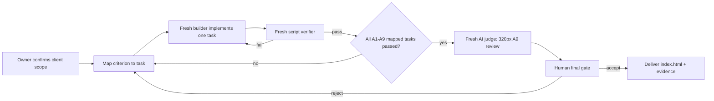

# Loop Plan — home-supplies-mvp

## Implementation record — 2026-08-08

- Human approval received: lifecycle status is `approved`.
- The interface-only sample is saved as `index.html` alongside this plan.
- Present scope: mobile-first form, static item rows, and static monthly-spend card.
- Not implemented: record validation, calculations, thresholds, localStorage, empty state, clear confirmation, and acceptance verification. A1–A9 remain incomplete.
- 2026-08-08 logic-only update: added pure record-derived remaining-quantity and current-month-spend functions, exact cents aggregation, HKD formatting, and console `selfCheck()` fixtures in `index.html`. No interface or storage implementation was changed; A1–A9 remain incomplete pending their wider requirements.

## 1. Goal and definition of done

Build the single-file household-supplies MVP described by `SPEC.yaml`. Done means A1–A9 have mapped implementation tasks and passing evidence, excluded capabilities are absent, and a human passes the final gate. Before producing this plan, remind the owner to obtain the client's agreement on the MVP scope; this is a workflow reminder, not a requirement for the owner to approve `SPEC.yaml` on every run.

## 2. Criteria-to-task map

| SPEC | Required task | Verification gate |
|---|---|---|
| A1 | Build record-entry form; make price required only for 買咗. | Script: form validation and storage cases. |
| A2 | Render a distinct-item list, aggregated by item name. | Script: distinct-row and displayed-field checks. |
| A3 | Implement remaining quantity as a pure reduction over records. | Script: recalculation and no-balance-storage check. |
| A4 | Derive current-month item and household spend from purchase records. | Script: current/prior month fixtures. |
| A5 | Parse/store/add monetary values as integer cents; format HKD. | Script: `0.10 + 0.20 = HK$0.30`. |
| A6 | Store and edit per-item threshold; render low-stock state. | Script: equality and greater-than boundary cases. |
| A7 | Apply status precedence: negative, zero, low stock, none; suppress all if no threshold. | Script: 0, negative, missing-threshold cases plus no crash. |
| A8 | Read/write records and thresholds in localStorage; add empty state and confirm-clear flow. | Script: reload, cancel, and confirm cases. |
| A9 | Keep all code inline in `index.html`; make the UI usable at 320px. | Script dependency scan + AI judge viewport review. |

No task is optional. A task may not be marked complete without evidence for its mapped criterion.

## 3. Build council

Each loop uses fresh agents/contexts so a reviewer does not assess its own prior output.

| Role | Responsibility | May not do |
|---|---|---|
| Builder | Implement only the current mapped task in `index.html`. | Add scope, alter an unrelated layer, or claim verification. |
| Script verifier | Run deterministic acceptance checks and report pass/fail with output. | Judge visual taste or waive a failed check. |
| AI judge | Review the 320px rendered UI using the A9 rubric. | Verify arithmetic, storage internals, or scope approval. |
| Human gate | Confirm client scope, review evidence, and accept or reject delivery. | Be replaced by AI or a script. |

## 4. Implementation architecture

| Layer | Contents | Source of truth |
|---|---|---|
| Interface | Record form, type-sensitive price input, item rows, threshold control, monthly total, empty state, clear confirmation. | Rendered from derived view data and saved settings. |
| Logic | Record validation, cents conversion, monthly filtering, aggregation, remaining calculation, status precedence. | Pure functions over records plus thresholds. |
| Storage | `localStorage` records array and per-item threshold map. | Persisted browser state only. |

Events (a purchase or usage record) live in the records array. Current state (remaining quantity and monthly totals) is derived at render time and is never stored as an independent balance.

## 5. Three gates

1. **Scope check** — before planning: remind the owner to confirm client agreement on MVP scope; every A1–A9 maps to the table above; excluded scope is retained.
2. **Evidence gate** — after each task: deterministic checks pass for the mapped criterion; failures return to Builder with only the failed evidence.
3. **Delivery gate** — after all evidence passes: AI judge reviews 320px usability; human reviews evidence and gives the final accept/reject decision.

## 6. Loop sequence

## 7. Repair rules and non-goals

- A repair changes only the layer implicated by failed evidence where practical. For example, changing a threshold value affects interface input and storage value, then triggers logic/rendering; it must not rewrite transaction records.
- Changing the **threshold rule** is logic-layer work; changing the **threshold value** is a user setting change. Do not conflate them.
- Do not add a rule such as “usage cannot exceed remaining stock”: it conflicts with A7, which requires negative remaining to show `數對唔上` without crashing.
- Do not add login, accounts, synchronization, currency selection, push notifications, backend, or deployment work.

## 8. Stop and handoff

Stop after six loops, 90 minutes, or two consecutive loops blocked by the same issue. On stop, generate the `not_done_report` defined in `SPEC.yaml`; identify the failed criterion and evidence, and leave all passing criteria intact. Only a human can authorize a scope change or accept an incomplete delivery.
